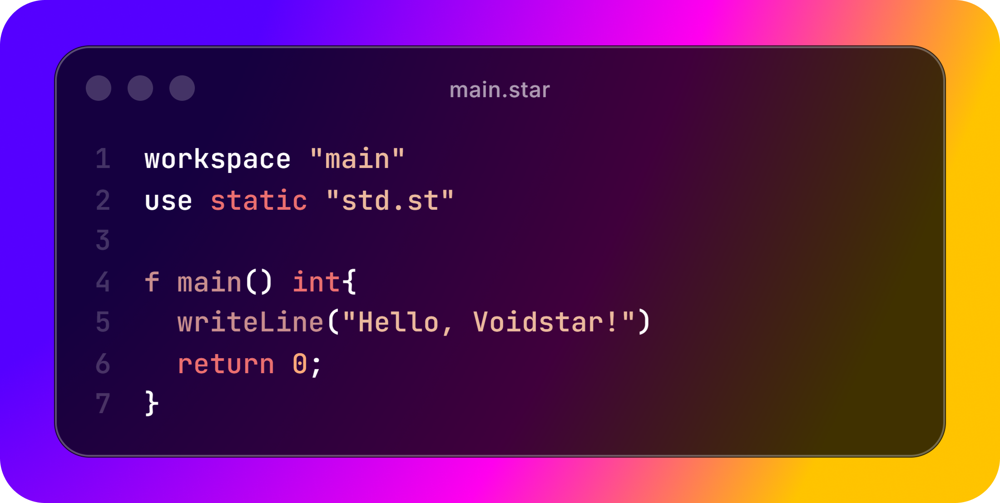

<h1>Voidstar</h1>

A Compiled language, born from the stars, destined to become a never-ending void.

---

### What's Voidstar?

Voidstar will be a compiled language, that's all I'm sure of for now.

This project will be my biggest one so far, it's been inspired by Rust, Zig and C.

It's biggest differential is the syntax, which is modern, simple and robust.
Voidstar abstracts some concepts for new developers, while also providing complex and useful commands, like pointers and lambdas for the more experienced ones.

For a matter of comparison, you could say that ***Voidstar is the modern C***.

> [!IMPORTANT]
> ### Current state of development
> 
> Voidstar is still on it's early stages of development, the syntax, concepts and everything is still being planned and enhanced.
>
> Unfortunately, voidstar is being placed on stand-by, because I'm busy working on my final project with my team.
>
> It'll have to be a "weekend" project, because I can't work on it otherwise.

### Syntax

For voidstar's syntax, visit [the syntaxes page](SYNTAX.md)

In terms of built-in methods, I'll write a documentation that will encompass all the information you'll need, aswell as new and deprecated methods.

### Contributing

Please feel free to open Pull Requests.

Issues are enabled for documentation and to keep track of development/bugs, I'll create a discord server to help you centralize your issue, if they're too complex.
